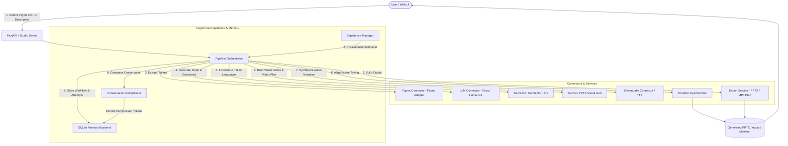

# AI Content Studio — CogniCore-Powered Prototype

> **Production-ready AI Content Studio prototype powered by CogniCore runtime memory, reflection, and experience-transfer layers.**

The AI Content Studio takes a Figma design (or URL / design description), extracts design context and semantic tokens, creates a presentation or video script using a configurable LLM (Groq / OpenAI), optionally localizes the script into Indian languages via Sarvam AI, drafts presentation visuals (PowerPoint PPTX or Canva video plan), generates voice narration via ElevenLabs, synchronizes narration with a scene timeline, and persists all workflow events and experiences inside **CogniCore**.

---

## 🏗️ Architecture



---

## 🚀 Key Features

1. **Figma Context Extraction**:
   - Parses Figma URLs or accepts natural language design specs.
   - Extracts design tokens (colors, fonts, components, concepts) and derives semantic aesthetic concepts (e.g. *Minimalist* vs. *Bold*).
2. **Configurable LLM Content Engine**:
   - Generates multi-scene scripts, visual descriptions, and suggested timings based on design tokens.
   - Defaults to Groq (`llama-3.3-70b-versatile`) with automatic fallback to deterministic fixtures in Mock Mode.
3. **Sarvam AI Localization**:
   - Localizes English scripts into 10 Indian languages: Hindi (`hi`), Tamil (`ta`), Telugu (`te`), Kannada (`kn`), Malayalam (`ml`), Marathi (`mr`), Bengali (`bn`), Gujarati (`gu`), Punjabi (`pa`).
   - Measures prompt token compression and language adaptation metrics.
4. **Canva & PPTX Visual Generation**:
   - Generates real Microsoft PowerPoint (`.pptx`) presentations with colored theme backgrounds, structured slides, and speaker narration notes.
   - Produces Canva-compatible video storyboard plans (`video_manifest.json`).
5. **ElevenLabs Narration Synthesis**:
   - Selects optimal voices (e.g., *Rachel* for Minimalist, *Adam* for Bold).
   - Generates `.mp3` audio files per scene using ElevenLabs Multilingual v2.
6. **Timeline Synchronization**:
   - Re-aligns visual scene durations to match spoken voiceover lengths.
   - Reports sync status (`synced`, `partial`, `unsynced`) and duration deltas.
7. **CogniCore Experience & Memory OS**:
   - **Pre-execution Retrieval**: Queries `ExperienceManager` for previous successful scripts and failure warnings before running.
   - **Conversation & Event Storage**: Records full dialogue, connector inputs/outputs, and step results as `MemoryEntry` records.
   - **Structured Experience Record**: Stores outcome with verification evidence, attempts, and content hashes.
   - **Cross-Session Conversation Compression**: Compresses transcripts (role abbreviations, removing filler words) and calculates original vs. compressed token savings.
8. **Resilience & Production Safety**:
   - Exponential backoff retries (`1s`, `2s`, `4s`) for external APIs.
   - Idempotent job execution.
   - Full Mock Mode for offline testing without paid API keys.

---

## 📊 Connector Status & Limitations

| Connector | Real API Status | Mock Mode Fallback | Notes & Limitations |
|---|---|---|---|
| **CogniCore** | ✅ **LIVE** (Built-in) | N/A (Always Live) | Uses local SQLite database (`cognicore_content_studio.db`). |
| **Figma** | ✅ **LIVE** (`FIGMA_ACCESS_TOKEN`) | ✅ Deterministic Fixture | REST API (`/v1/files/`). URL parsing or text description fallback. |
| **LLM (Groq)** | ✅ **LIVE** (`GROQ_API_KEY`) | ✅ 3-Scene Script Fixture | Groq OpenAI-compatible client (`llama-3.3-70b-versatile`). |
| **Sarvam AI** | ✅ **LIVE** (`SARVAM_API_KEY`) | ✅ Labeled Language Mock | POST `https://api.sarvam.ai/v1/chat/completions` with `sarvam-m1`. |
| **ElevenLabs** | ✅ **LIVE** (`ELEVENLABS_API_KEY`) | ✅ Word-count Estimation | Multilingual v2 TTS. In mock mode, estimates ~2.5 words/sec. |
| **Canva** | ⚠️ **MOCK ONLY** | ✅ Structured Plan JSON | Canva Connect API requires OAuth app approval. Real PPTX generated via `python-pptx`. |

---

## 🛠️ Setup & Installation

### 1. Prerequisites
- Python 3.10, 3.11, or 3.12
- Optional: `python-pptx` for real PowerPoint generation (`pip install python-pptx`)

### 2. Install Dependencies
```bash
cd cognicore-my-openenv
pip install -e .
pip install fastapi uvicorn requests python-dotenv python-pptx
```

### 3. Environment Configuration
Copy `.env.example` to `.env` and supply your credentials:
```bash
cp .env.example .env
```

Edit `.env`:
```ini
# Run in mock mode without API keys:
MOCK_MODE=false

# Real API credentials (leave blank for mock fallback)
FIGMA_ACCESS_TOKEN=your_figma_token
GROQ_API_KEY=your_groq_key
ELEVENLABS_API_KEY=your_elevenlabs_key
SARVAM_API_KEY=your_sarvam_key

# Canva placeholder (always labeled as mock)
CANVA_API_KEY=your_canva_key

# Studio Server settings
STUDIO_HOST=127.0.0.1
STUDIO_PORT=8501
```

---

## 💻 Running the Studio

### Start the Studio Server
```bash
python -m content_studio.run
```
Output:
```
==============================================================
  AI Content Studio — CogniCore-Powered
==============================================================
  Dashboard : http://127.0.0.1:8501
  API Docs  : http://127.0.0.1:8501/docs
  Mock Mode : OFF
  Database  : ...\cognicore_content_studio.db

  ✓ figma         : live
  ✓ llm           : live
  ✓ elevenlabs    : live
  ✓ sarvam        : live
  ○ canva         : mock (requires OAuth app approval)
  ✓ cognicore     : live (built-in)
==============================================================
```

Open `http://127.0.0.1:8501` in your browser to interact with the visual dashboard.

---

## 🧪 Testing

The test suite includes 29 unit, integration, and end-to-end tests covering all connectors, workflow transitions, services, and CogniCore persistence in deterministic mock mode:

```bash
# Run all tests
python -m pytest tests/test_content_studio.py -v

# Run with short tracebacks
python -m pytest tests/test_content_studio.py -v --tb=short
```

---

## 📡 REST API Contracts

### `POST /api/projects`
Creates a new project.
- **Request Body**:
  ```json
  {
    "name": "Fintech Launch Video",
    "figma_input": "https://figma.com/file/abc123xyz/fintech-app",
    "language": "hi",
    "output_type": "pptx"
  }
  ```
- **Response** (`200 OK`):
  ```json
  {
    "project_id": "proj_1234567890ab",
    "name": "Fintech Launch Video",
    "state": "pending",
    "language": "hi",
    "output_type": "pptx",
    "created_at": "2026-09-19T13:00:00Z"
  }
  ```

### `POST /api/projects/{project_id}/run`
Executes the workflow pipeline.
- **Response** (`200 OK`):
  Returns the updated `Project` object with `state`, `script`, `scenes`, `timeline`, `step_results`, and `artifacts`.

### `GET /api/projects/{project_id}/timeline`
Returns the synchronized audio/visual timeline.

### `GET /api/projects/{project_id}/download/{artifact_name}`
Downloads the generated `.pptx` presentation or audio files.

### `GET /api/memory/experiences`
Returns past CogniCore structured experiences and failure warnings.

### `GET /api/memory/conversation/{project_id}`
Returns the full conversation turns and connector observations recorded for a project.

---

## 🔒 Safety & Provenance

- **Secret Handling**: No API keys are committed or stored in memory entries. Keys are read only from environment variables at runtime.
- **Provenance Hashes**: CogniCore computes deterministic SHA-256 content hashes over task solutions and evidence.
- **Verification Gate**: Experiences are flagged as `candidate`, `verified`, or `needs_review` based on execution evidence and whether mock adapters were used.
